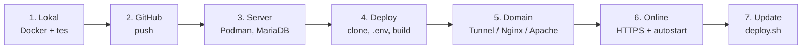
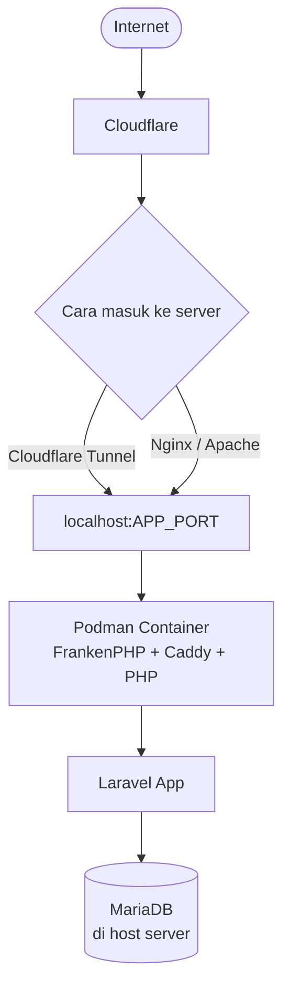

<div align="center">

# Laravel Production Deployment

**Dari laptop ke server: panduan deploy Laravel yang bisa dipakai ulang untuk project apa pun**


</div>

Repo ini adalah template dan panduan untuk men-deploy aplikasi Laravel ke server/VPS dengan alur yang selalu sama: **tes di lokal → push ke GitHub → clone di server → setup → hubungkan domain → online dengan HTTPS.**

Panduannya dipecah per tahap supaya mudah diikuti dan dicari ulang. Dokumentasi dibuat berdasarkan deployment Laravel production yang telah diuji langsung, lalu digeneralisasi agar bisa dipakai untuk project lain.

## Daftar Isi

- [Teknologi](#teknologi)
- [Alur dan Arsitektur](#alur-dan-arsitektur)
- [Panduan Lengkap](#panduan-lengkap)
- [Quick Start](#quick-start)
- [Placeholder](#placeholder)
- [File Konfigurasi](#file-konfigurasi)
- [Struktur Repo](#struktur-repo)
- [Prinsip Deployment](#prinsip-deployment)
- [Peringatan Penting](#peringatan-penting)
- [Lisensi](#lisensi)

## Teknologi

| Komponen | Peran |
|----------|-------|
| **Laravel** | Aplikasi |
| **FrankenPHP + Caddy** | Web server dan PHP di dalam container |
| **Docker Compose** | Menjalankan container di lokal |
| **Podman** | Menjalankan container di server production |
| **MariaDB** | Database, berjalan di host (bukan di container) |
| **Cloudflare Tunnel** | Cara disarankan untuk membuka aplikasi ke internet tanpa membuka port |
| **Nginx / Apache** | Alternatif reverse proxy |
| **Google OAuth (Socialite)** | Login Google (opsional) |

## Alur dan Arsitektur

Alur kerja:



Arsitektur di server:



Tiga cara menghubungkan domain ke container:

| Cara | Alur | Butuh Nginx/Apache? |
|------|------|:-------------------:|
| **Cloudflare Tunnel** (disarankan) | Cloudflare → Tunnel → Container | Tidak |
| **Nginx** | Cloudflare → Nginx → Container | Ya |
| **Apache** | Cloudflare → Apache → Container | Ya |

## Panduan Lengkap

Ikuti berurutan dari 1 sampai 6. Langkah 7 dan seterusnya dipakai setelah aplikasi online.

| # | Panduan | Dikerjakan di | Isi |
|:-:|---------|:-------------:|-----|
| 1 | [Persiapan Lokal](docs/01-persiapan-lokal.md) | Laptop | File container, `.env`, database, build, tes di `127.0.0.1` |
| 2 | [Push ke GitHub](docs/02-push-github.md) | Laptop | Buat repo, commit, push, pastikan `.env` tidak ikut |
| 3 | [Siapkan Server](docs/03-siapkan-server.md) | Server | Install Podman dan MariaDB, firewall, database, Cloudflare Tunnel |
| 4 | [Deploy di Server](docs/04-deploy-server.md) | Server | Clone, `.env` production, build, composer, migrate, cek origin |
| 5 | [Hubungkan Domain](docs/05-hubungkan-domain.md) | Server + Cloudflare | Tunnel / Nginx / Apache, DNS, SSL |
| 6 | [Verifikasi dan Autostart](docs/06-verifikasi-autostart.md) | Server | Tes berlapis, autostart, tes reboot, checklist akhir |
| 7 | [Update dan Operasional](docs/07-update-dan-operasional.md) | Server | `deploy.sh`, log, restart, backup, maintenance |
| 8 | [Google OAuth](docs/08-google-oauth.md) | Server | Login Google (opsional) |
| 9 | [Troubleshooting](docs/09-troubleshooting.md) | Kapan saja | Gejala umum dan cara memperbaikinya |

Ingin checklist yang bisa dicentang? Buat issue dari template **Deployment checklist** (Issues → New issue). Checkbox di file `.md` hanya tampilan.

Baru pertama kali? Mulai dari [1. Persiapan Lokal](docs/01-persiapan-lokal.md).
Aplikasi sudah online dan hanya ingin update? Langsung ke [7. Update dan Operasional](docs/07-update-dan-operasional.md).
Ada error? Buka [9. Troubleshooting](docs/09-troubleshooting.md).

## Quick Start

Ringkasan perintah untuk yang sudah paham alurnya. Detail dan penjelasan ada di panduan masing-masing.

**Di lokal** ([panduan](docs/01-persiapan-lokal.md))

```bash
cp .env.example .env
sed -i "s|^APP_KEY=.*|APP_KEY=base64:$(openssl rand -base64 32)|" .env
nano .env                                  # APP_ENV=local, DB, APP_PORT, CONTAINER_NAME

docker compose build --no-cache
docker compose up -d
docker compose exec app php artisan migrate
curl -I http://127.0.0.1:8000
```

**Push ke GitHub** ([panduan](docs/02-push-github.md))

```bash
git add .
git status                                 # pastikan .env TIDAK ada
git commit -m "Add Docker setup with FrankenPHP and Caddy"
git push -u origin main
```

**Di server** ([panduan](docs/04-deploy-server.md))

```bash
cd /var/www
git clone <REPOSITORY_URL> <APP_DOMAIN>
cd <APP_DOMAIN>

cp .env.example .env
sed -i "s|^APP_KEY=.*|APP_KEY=base64:$(openssl rand -base64 32)|" .env
nano .env                                  # production, DB, APP_PORT, CONTAINER_NAME

podman compose build --no-cache
podman compose up -d

podman exec <CONTAINER_NAME> composer install --no-dev --optimize-autoloader --no-interaction
podman exec <CONTAINER_NAME> php artisan migrate --force
podman exec <CONTAINER_NAME> php artisan storage:link
podman exec <CONTAINER_NAME> php artisan optimize

curl -I http://127.0.0.1:<APP_PORT>
```

Lalu hubungkan domain ([panduan](docs/05-hubungkan-domain.md)) dan cek:

```bash
curl -I https://<APP_DOMAIN>
```

**Update berikutnya** ([panduan](docs/07-update-dan-operasional.md))

```bash
cd /var/www/<APP_DOMAIN>
bash scripts/deploy.sh
```

## Placeholder

Semua panduan memakai placeholder berikut. Ganti dengan nilai project kamu.

| Placeholder | Contoh |
|-------------|--------|
| `<PROJECT_NAME>` | Sistem Akademik |
| `<PROJECT_ALIAS>` | `akademik` |
| `<ROOT_DOMAIN>` | `example.com` |
| `<APP_DOMAIN>` | `akademik.example.com` |
| `<CONTAINER_NAME>` | `akademik-app` |
| `<APP_PORT>` | `8000` |
| `<DB_NAME>` | `akademik` |
| `<DB_USER>` | `akademik` |
| `<DB_PASSWORD>` | hasil `openssl rand -hex 16` |
| `<GITHUB_USER>` | `aburifanul` |
| `<REPO_NAME>` | `akademik` |
| `<REPOSITORY_URL>` | `git@github.com:aburifanul/akademik.git` |
| `<SERVER_IP>` | IP VPS |
| `<SERVER_USER>` | user SSH di VPS |
| `<TUNNEL_UUID>` | UUID Cloudflare Tunnel (hanya untuk DNS manual) |

> **Penting:** placeholder hanya untuk dokumentasi. Jangan menulis `${APP_DOMAIN}` atau `${DB_NAME}` di `.env` Laravel dengan asumsi akan diekspansi seperti shell. Tulis **nilai final yang sudah resolved**.

## File Konfigurasi

File-file ini disalin ke project Laravel kamu. Isi lengkap dan penjelasannya ada di [Persiapan Lokal](docs/01-persiapan-lokal.md#12-tambahkan-file-container).

| File | Fungsi |
|------|--------|
| [`docker/php/Dockerfile`](docker/php/Dockerfile) | Image FrankenPHP (PHP 8.4, Alpine) dengan extension Laravel dan dependency production |
| [`docker/php/Caddyfile`](docker/php/Caddyfile) | Caddy melayani folder `public` Laravel; HTTPS ditangani layer di depan container |
| [`docker/php/php.ini`](docker/php/php.ini) | Batas upload, memory, dan opcache |
| [`docker-compose.yml`](docker-compose.yml) | Definisi container: nama dan port dari `.env`, bind ke `127.0.0.1`, `restart: always` |
| [`.dockerignore`](.dockerignore) | File yang tidak ikut build (secret, `vendor`, cache) |
| [`.env.example`](.env.example) | Template environment untuk lokal dan server |
| [`scripts/deploy.sh`](scripts/deploy.sh) | Script update di server |

## Struktur Repo

```text
laravel-production-deployment/
├── README.md
├── LICENSE
├── .gitignore
├── .dockerignore
├── .env.example
├── docker-compose.yml
│
├── .github/
│   └── ISSUE_TEMPLATE/
│       └── deployment-checklist.md
│
├── docker/
│   └── php/
│       ├── Dockerfile
│       ├── Caddyfile
│       └── php.ini
│
├── scripts/
│   └── deploy.sh
│
└── docs/
    ├── 01-persiapan-lokal.md
    ├── 02-push-github.md
    ├── 03-siapkan-server.md
    ├── 04-deploy-server.md
    ├── 05-hubungkan-domain.md
    ├── 06-verifikasi-autostart.md
    ├── 07-update-dan-operasional.md
    ├── 08-google-oauth.md
    └── 09-troubleshooting.md
```

## Prinsip Deployment

1. Selalu tes di lokal dulu, baru deploy ke server.
2. Docker untuk development/testing, Podman untuk production.
3. FrankenPHP + Caddy menjadi web server di dalam container.
4. MariaDB berjalan di host dan diakses lewat `host.containers.internal`.
5. Port container hanya di-bind ke `127.0.0.1`; akses publik lewat Cloudflare Tunnel, Nginx, atau Apache.
6. HTTPS publik ditangani layer proxy/Cloudflare, dan Laravel dipaksa memakai HTTPS di production.
7. Production memakai `migrate --force`, bukan `migrate:fresh`.
8. `.env` tidak pernah di-commit, dan `APP_KEY` production tidak diganti sembarangan.
9. Origin harus berhasil sebelum debugging DNS atau Cloudflare.
10. Update lewat `scripts/deploy.sh` supaya langkahnya selalu sama.

## Peringatan Penting

> **`APP_KEY`:** jangan jalankan `php artisan key:generate --force` pada aplikasi yang sudah berjalan di production. Mengganti `APP_KEY` membuat data terenkripsi, session, dan cookie lama tidak bisa dipakai.

> **`migrate:fresh`:** jangan pernah dipakai di production. Perintah ini menjalankan `DROP TABLE` dan **seluruh data hilang**. Gunakan `php artisan migrate --force`.

> **`podman compose down -v`:** jangan pakai `-v` sembarangan karena menghapus volume.

> **Secret:** contoh di dokumentasi ini sengaja tidak berisi password database, `APP_KEY`, Google Client Secret, atau token Cloudflare. Secret hanya ada di `.env` server dan **tidak boleh di-commit ke GitHub**.

## Lisensi

[MIT](LICENSE) © 2026 aburifanul
